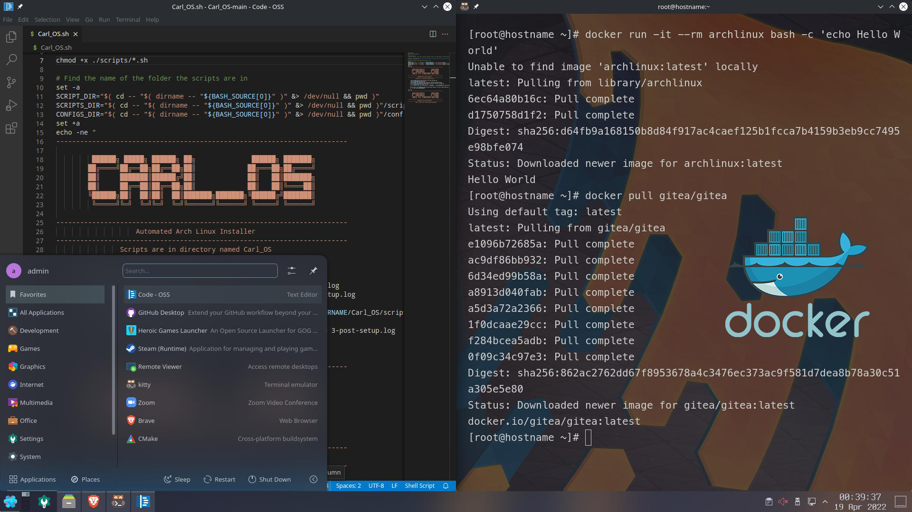

# Carl_OS

[Arch Titus](https://github.com/ChrisTitusTech/ArchTitus) fork to build my own Arch Linux flavour. It features an automated Arch Linux install, streamlining said process quite significantly.



This README contains the steps I do to install and configure a fully-functional Arch Linux installation containing a desktop environment, all the support packages (network, bluetooth, audio, printers, etc.), along with all my preferred applications and utilities. The shell scripts in this repository allow the entire process to be automated.

---
## Installation Process

Download the Arch Linux .iso file from <https://archlinux.org/download/> and mount it on a USB drive with [Etcher](https://www.balena.io/etcher/), [Ventoy](https://www.ventoy.net/en/index.html), [Rufus](https://rufus.ie/en/) or whichever tool you prefer.

Then, use the aforementioned USB to boot into Arch Linux. If you are using Wi-Fi instead of an Ethernet connection, refer to [Wi-Fi Installation](#wi-fi-installation). If not, type the following commands upon the initial prompt:

```
pacman -Sy git
git clone https://github.com/outerelocarlos/Carl_OS
cd Carl_OS
chmod +x ./Carl_OS.sh
./Carl_OS.sh
```

This initiates an almost completely automated Arch Linux install. This process includes prompts to select your desired desktop environment, window manager, AUR helper, and whether to do a full or minimal install.

### Wi-Fi Installation

First of all, you should check if your Wi-Fi network is blocked. To do so, run `rfkill list`.
If the output says **Soft blocked: yes**, then run `rfkill unblock wifi`.

After unblocking the Wi-Fi, you can connect to it. To do so, go through these 5 steps:

1. Run `iwctl`

2. Run `device list` and find your device's name.

3. Run `station [device name] scan`.

4. Run `station [device name] get-networks`.

5. Find your network and run `station [device name] connect [network name]`, enter your password and run `exit`. You can test if you have internet connection by running `ping google.com`, and then press Ctrl and C (Ctrl+C) to stop the ping test.

After these 5 steps, you may now type the previously provided commands to install Carl_OS

---
## Documentation

The package selection and their purpose is detailed in the **[PKG_Documentation.md](PKG_Documentation.md)** file.

## Troubleshooting

**[Arch Linux RickEllis Installation Guide](https://github.com/rickellis/Arch-Linux-Install-Guide)**

**[Arch Linux Wiki Installation Guide](https://wiki.archlinux.org/title/Installation_guide)**

The main script will generate .log files for every script that is run as part of the installation process. These log files contain the terminal output so you can review any warnings or errors that occurred during installation (helps with the troubleshooting).

## Acknowledgements

This is a forked project based on [Arch Titus](https://github.com/ChrisTitusTech/ArchTitus). As such, most of the credit should go to Chris Titus and all of the amazing devs and enthusiasts who have contributed to the project. I would like to highlight the work done by [Austin Horstman](https://github.com/khaneliman) since he has really improved upon the structure of the project and streamlined the installation process.